# CureBay TotalCare — Complete Database Design Document

**Project:** CureBay TotalCare Storefront  
**Database Engine:** SQLite 3  
**Normalization:** Third Normal Form (3NF)  
**Designed For:** Node.js + Express backend · React frontend · Future Admin Panel  
**Date:** 2026-06-08  

---

## Phase 1 — Entity Identification

### 1.1 Repeatable vs Non-Repeatable Content

| Content | Type | Reason |
|---|---|---|
| Products (devices + bundles) | Repeatable | Multiple SKUs, new products added |
| Product features | Repeatable | Each product has N bullet points |
| Product images | Repeatable | Each product has N gallery images |
| Bundle components | Repeatable | A bundle contains N individual products |
| Health concern categories | Repeatable | Admin can add new care categories |
| Subscription plans | Repeatable | Multiple plan tiers |
| Subscription features | Repeatable | Shared benefit list across plans |
| Care services | Repeatable | 6+ service cards editable by admin |
| Service feature bullets | Repeatable | Each service has N bullet points |
| Testimonials | Repeatable | Multiple testimonials per service/product |
| FAQs | Repeatable | Admin adds/removes questions |
| FAQ list items | Repeatable | Each list-type FAQ has N items |
| FAQ steps | Repeatable | Each step-type FAQ has N steps |
| FAQ step items | Repeatable | Each step has N sub-items |
| Health 360 frames | Repeatable | Scroll animation frames |
| Health 360 frame bullets | Repeatable | N bullets per frame |
| Footer sections | Repeatable | Multiple link groups |
| Footer links | Repeatable | N links per footer section |
| Navigation items | Repeatable | Multi-level nav with sub-items |
| Hero section config | Non-Repeatable | One hero banner at a time |
| Doctor banner config | Non-Repeatable | One doctor banner at a time |
| Site-wide config | Non-Repeatable | Brand name, contact, social links |

---

### 1.2 Complete Entity Inventory (37 Tables)

#### Content & Display Tables (drive UI)

| # | Table | Section It Powers |
|---|---|---|
| 1 | `products` | Product Showcase, Individual Listing, Product Detail, Cart |
| 2 | `product_features` | Individual Listing, Product Detail |
| 3 | `product_images` | All product cards and detail views |
| 4 | `product_bundle_items` | Bundle/Combo product cards |
| 5 | `health_concerns` | Product Showcase tabs |
| 6 | `concern_recommendations` | Product Showcase — recommended product per concern |
| 7 | `concern_description_parts` | Product Showcase — color-coded description text |
| 8 | `subscription_plans` | Subscription Section cards |
| 9 | `subscription_description_lines` | Description text under plan price |
| 10 | `subscription_features` | Shared feature rows above plan cards |
| 11 | `subscription_plan_features` | M:N — which features belong to which plans |
| 12 | `subscription_price_breakdowns` | Modal — price breakdown table |
| 13 | `subscription_savings` | Modal — "You Saved" rows |
| 14 | `subscription_billing_info` | Modal — billing info bullets |
| 15 | `care_services` | Care We Offer — 6 expandable service cards |
| 16 | `service_features` | Care We Offer — bullet points per service |
| 17 | `testimonials` | Care We Offer, Product Detail, Success Stories |
| 18 | `faq_categories` | FAQ — question groupings |
| 19 | `faqs` | FAQ Section |
| 20 | `faq_list_items` | FAQ — list-type answers |
| 21 | `faq_steps` | FAQ — step-type answer headings |
| 22 | `faq_step_items` | FAQ — step-type answer items |
| 23 | `highlight_cards` | Highlight/Ecosystem Section — 6 service cards |
| 24 | `health360_frames` | Health Overview — scroll animation frames |
| 25 | `health360_frame_bullets` | Health Overview — bullets per frame |
| 26 | `product_detail_tabs` | Product Detail — device tab definitions |
| 27 | `product_detail_vitals` | Product Detail — vital stats per tab |
| 28 | `product_detail_insights` | Product Detail — insight card per tab |
| 29 | `product_showcase_bullets` | Product Showcase — general feature bullets |
| 30 | `footer_sections` | Footer — column headings |
| 31 | `footer_links` | Footer — navigation links |
| 32 | `nav_items` | Header — navigation items |
| 33 | `site_config` | Hero, Doctor Banner, brand config |

#### Future-Proof Transactional Tables

| # | Table | Purpose |
|---|---|---|
| 34 | `users` | Customer and admin accounts |
| 35 | `user_subscriptions` | Active subscription per user |
| 36 | `orders` | Purchase orders |
| 37 | `order_items` | Line items (product or subscription) per order |

---

### 1.3 Attribute Analysis Per Major Entity

#### products
```
id                TEXT        Slug PK ('bp', 'scale', 'glucose', 'bp-essentials', ...)
name              TEXT        Display name
subtitle          TEXT        Brand or "powered by Total Care"
description       TEXT        Long-form product description
price             INTEGER     Sale price in INR (no decimals needed)
original_price    INTEGER     MRP in INR
discount_pct      INTEGER     Computed discount % for display
rating            REAL        0.0–5.0 star rating
review_count      INTEGER     Number of reviews
features_title    TEXT        Heading above feature bullets
product_type      TEXT        'individual' | 'bundle'
is_active         INTEGER     Soft delete flag (1=active)
display_order     INTEGER     Sort position in listing
created_at        TEXT        ISO 8601 datetime
updated_at        TEXT        ISO 8601 datetime
```

#### subscription_plans
```
id                TEXT        'quarterly' | 'yearly'
title             TEXT        "Quarterly Plan" | "Yearly plan"
plan_type         TEXT        'quarterly' | 'yearly'
original_price    INTEGER     Crossed-out price
discounted_price  INTEGER     Actual price
price_period      TEXT        'month' | 'year'
currency          TEXT        'INR'
subtitle          TEXT        Modal subtitle
title_color       TEXT        Hex color for modal title
cta_text          TEXT        Button label
is_active         INTEGER
is_featured       INTEGER
display_order     INTEGER
created_at        TEXT
updated_at        TEXT
```

#### care_services
```
id                TEXT        'doctor' | 'ai' | 'concierge' | 'diet' | 'device' | 'medicines'
label             TEXT        "Family Doctor Consultation"
headline          TEXT        Large card headline
accent_text       TEXT        Colored accent phrase
icon_name         TEXT        Asset reference for icon
expanded_panel_top    INTEGER CSS top offset for expanded panel
expanded_bullets_top  INTEGER CSS top offset for bullet list
display_order     INTEGER
is_active         INTEGER
```

#### faqs
```
id                INTEGER     Auto PK
question          TEXT        The question text
answer_type       TEXT        'text' | 'list' | 'steps'
answer_text       TEXT        Used only when answer_type = 'text'
category_id       INTEGER     FK → faq_categories
display_order     INTEGER
is_active         INTEGER
created_at        TEXT
updated_at        TEXT
```

---

## Phase 2 — ER Diagram

### 2.1 Mermaid ERD (renderable in GitHub, Notion, VS Code)

```mermaid
erDiagram

    products {
        TEXT id PK
        TEXT name
        TEXT subtitle
        TEXT description
        INTEGER price
        INTEGER original_price
        INTEGER discount_pct
        REAL rating
        INTEGER review_count
        TEXT features_title
        TEXT product_type
        INTEGER is_active
        INTEGER display_order
        TEXT created_at
        TEXT updated_at
    }

    product_features {
        INTEGER id PK
        TEXT product_id FK
        TEXT feature_text
        INTEGER display_order
    }

    product_images {
        INTEGER id PK
        TEXT product_id FK
        TEXT image_url
        TEXT alt_text
        INTEGER is_primary
        INTEGER display_order
    }

    product_bundle_items {
        INTEGER id PK
        TEXT bundle_id FK
        TEXT component_id FK
        INTEGER display_order
    }

    health_concerns {
        TEXT id PK
        TEXT label
        TEXT description
        TEXT icon_name
        INTEGER display_order
        INTEGER is_active
    }

    concern_recommendations {
        INTEGER id PK
        TEXT concern_id FK
        TEXT product_id FK
        INTEGER display_order
    }

    concern_description_parts {
        INTEGER id PK
        TEXT concern_id FK
        TEXT part_text
        INTEGER is_highlighted
        INTEGER display_order
    }

    subscription_plans {
        TEXT id PK
        TEXT title
        TEXT plan_type
        INTEGER original_price
        INTEGER discounted_price
        TEXT price_period
        TEXT currency
        TEXT subtitle
        TEXT title_color
        TEXT cta_text
        INTEGER is_active
        INTEGER is_featured
        INTEGER display_order
        TEXT created_at
        TEXT updated_at
    }

    subscription_description_lines {
        INTEGER id PK
        TEXT plan_id FK
        TEXT line_text
        INTEGER display_order
    }

    subscription_features {
        INTEGER id PK
        TEXT feature_text
        TEXT icon_name
        INTEGER display_order
        INTEGER is_active
    }

    subscription_plan_features {
        TEXT plan_id FK
        INTEGER feature_id FK
    }

    subscription_price_breakdowns {
        INTEGER id PK
        TEXT plan_id FK
        TEXT label
        TEXT original_display
        TEXT discounted_display
        INTEGER display_order
    }

    subscription_savings {
        INTEGER id PK
        TEXT plan_id FK
        TEXT label
        TEXT value_text
        INTEGER display_order
    }

    subscription_billing_info {
        INTEGER id PK
        TEXT plan_id FK
        TEXT info_text
        INTEGER display_order
    }

    care_services {
        TEXT id PK
        TEXT label
        TEXT headline
        TEXT accent_text
        TEXT icon_name
        INTEGER expanded_panel_top
        INTEGER expanded_bullets_top
        INTEGER display_order
        INTEGER is_active
    }

    service_features {
        INTEGER id PK
        TEXT service_id FK
        TEXT feature_text
        INTEGER display_order
    }

    testimonials {
        INTEGER id PK
        TEXT person_name
        TEXT badge_text
        TEXT quote
        TEXT photo_url
        TEXT service_id FK
        TEXT product_id FK
        TEXT context
        INTEGER is_featured
        INTEGER display_order
        INTEGER is_active
        TEXT created_at
    }

    faq_categories {
        INTEGER id PK
        TEXT name
        TEXT slug
        INTEGER display_order
    }

    faqs {
        INTEGER id PK
        TEXT question
        TEXT answer_type
        TEXT answer_text
        INTEGER category_id FK
        INTEGER display_order
        INTEGER is_active
        TEXT created_at
        TEXT updated_at
    }

    faq_list_items {
        INTEGER id PK
        INTEGER faq_id FK
        TEXT item_text
        INTEGER display_order
    }

    faq_steps {
        INTEGER id PK
        INTEGER faq_id FK
        TEXT step_title
        INTEGER display_order
    }

    faq_step_items {
        INTEGER id PK
        INTEGER step_id FK
        TEXT item_text
        INTEGER display_order
    }

    highlight_cards {
        INTEGER id PK
        TEXT label
        TEXT service_id FK
        TEXT overlay_type
        INTEGER display_order
        INTEGER is_active
    }

    health360_frames {
        INTEGER id PK
        TEXT title_lines
        TEXT body_text
        INTEGER display_order
        INTEGER is_active
    }

    health360_frame_bullets {
        INTEGER id PK
        INTEGER frame_id FK
        TEXT bullet_text
        INTEGER display_order
    }

    product_detail_tabs {
        TEXT id PK
        TEXT product_id FK
        TEXT tab_label
        TEXT vitals_layout
        TEXT latest_reading_label
        INTEGER display_order
        INTEGER is_active
    }

    product_detail_vitals {
        INTEGER id PK
        TEXT tab_id FK
        TEXT icon_name
        TEXT label
        TEXT value
        TEXT unit
        TEXT value2
        TEXT unit2
        INTEGER display_order
    }

    product_detail_insights {
        INTEGER id PK
        TEXT tab_id FK
        TEXT icon_name
        TEXT label
        TEXT insight_type
        TEXT insight_text
        TEXT highlight_value
    }

    product_showcase_bullets {
        INTEGER id PK
        TEXT bullet_text
        INTEGER display_order
        INTEGER is_active
    }

    footer_sections {
        INTEGER id PK
        TEXT heading
        INTEGER display_order
        INTEGER is_active
    }

    footer_links {
        INTEGER id PK
        INTEGER section_id FK
        TEXT label
        TEXT url
        INTEGER opens_new_tab
        INTEGER display_order
        INTEGER is_active
    }

    nav_items {
        INTEGER id PK
        TEXT label
        TEXT url
        INTEGER parent_id FK
        INTEGER display_order
        INTEGER is_active
    }

    site_config {
        INTEGER id PK
        TEXT config_key
        TEXT config_value
        TEXT config_group
        TEXT updated_at
    }

    users {
        INTEGER id PK
        TEXT full_name
        TEXT email
        TEXT phone
        TEXT password_hash
        TEXT role
        INTEGER is_active
        TEXT created_at
        TEXT updated_at
    }

    user_subscriptions {
        INTEGER id PK
        INTEGER user_id FK
        TEXT plan_id FK
        TEXT status
        TEXT starts_at
        TEXT ends_at
        INTEGER auto_renew
        TEXT created_at
        TEXT updated_at
    }

    orders {
        INTEGER id PK
        INTEGER user_id FK
        TEXT order_number
        TEXT status
        INTEGER subtotal
        INTEGER discount
        INTEGER total_amount
        TEXT currency
        TEXT shipping_address
        TEXT created_at
        TEXT updated_at
    }

    order_items {
        INTEGER id PK
        INTEGER order_id FK
        TEXT product_id FK
        TEXT plan_id FK
        TEXT item_type
        INTEGER quantity
        INTEGER unit_price
        INTEGER total_price
    }

    %% Relationships
    products ||--o{ product_features : "has"
    products ||--o{ product_images : "has"
    products ||--o{ product_bundle_items : "is bundle"
    products ||--o{ product_bundle_items : "is component"
    products ||--o{ concern_recommendations : "recommended for"
    products ||--o{ product_detail_tabs : "detailed by"
    products ||--o{ testimonials : "has"
    products ||--o{ order_items : "ordered as"

    health_concerns ||--o{ concern_recommendations : "has"
    health_concerns ||--o{ concern_description_parts : "described by"

    subscription_plans ||--o{ subscription_description_lines : "has"
    subscription_plans ||--o{ subscription_plan_features : "offers"
    subscription_plans ||--o{ subscription_price_breakdowns : "breaks down into"
    subscription_plans ||--o{ subscription_savings : "saves"
    subscription_plans ||--o{ subscription_billing_info : "billed as"
    subscription_plans ||--o{ user_subscriptions : "subscribed via"
    subscription_plans ||--o{ order_items : "ordered as"
    subscription_features ||--o{ subscription_plan_features : "included in"

    care_services ||--o{ service_features : "has"
    care_services ||--o{ testimonials : "has"
    care_services ||--o{ highlight_cards : "displayed in"

    faq_categories ||--o{ faqs : "groups"
    faqs ||--o{ faq_list_items : "lists"
    faqs ||--o{ faq_steps : "steps through"
    faq_steps ||--o{ faq_step_items : "contains"

    health360_frames ||--o{ health360_frame_bullets : "has"

    product_detail_tabs ||--o{ product_detail_vitals : "shows"
    product_detail_tabs ||--o{ product_detail_insights : "displays"

    footer_sections ||--o{ footer_links : "contains"
    nav_items ||--o{ nav_items : "parent of"

    users ||--o{ user_subscriptions : "holds"
    users ||--o{ orders : "places"
    orders ||--o{ order_items : "contains"
```



---

### 2.2 Text-Based Relationship Map

```
PRODUCT CLUSTER
───────────────
products
  ├── product_features        (1:N)
  ├── product_images          (1:N)
  ├── product_bundle_items    (1:N as bundle)  ──→ products (as component)
  ├── product_detail_tabs     (1:N)
  │     ├── product_detail_vitals    (1:N)
  │     └── product_detail_insights  (1:N)
  ├── concern_recommendations (N:M via health_concerns)
  ├── testimonials            (1:N)
  └── order_items             (1:N)

HEALTH CONCERN CLUSTER
──────────────────────
health_concerns
  ├── concern_recommendations  (1:N) ──→ products
  └── concern_description_parts (1:N)

SUBSCRIPTION CLUSTER
────────────────────
subscription_plans
  ├── subscription_description_lines  (1:N)
  ├── subscription_plan_features      (N:M via subscription_features)
  ├── subscription_price_breakdowns   (1:N)
  ├── subscription_savings            (1:N)
  ├── subscription_billing_info       (1:N)
  ├── user_subscriptions              (1:N)
  └── order_items                     (1:N)

subscription_features (shared pool, M:N with plans)

CARE SERVICES CLUSTER
─────────────────────
care_services
  ├── service_features   (1:N)
  ├── testimonials       (1:N)
  └── highlight_cards    (1:N)

FAQ CLUSTER
───────────
faq_categories
  └── faqs               (1:N)
        ├── faq_list_items (1:N, when answer_type='list')
        └── faq_steps      (1:N, when answer_type='steps')
              └── faq_step_items (1:N)

HEALTH 360 CLUSTER
──────────────────
health360_frames
  └── health360_frame_bullets (1:N)

NAVIGATION CLUSTER
──────────────────
nav_items (self-referencing tree: parent_id → id)
footer_sections
  └── footer_links (1:N)

CONFIG CLUSTER
──────────────
site_config (flat key-value, grouped by config_group)

USER / TRANSACTIONAL CLUSTER (future)
──────────────────────────────────────
users
  ├── user_subscriptions ──→ subscription_plans
  └── orders
        └── order_items ──→ products | subscription_plans
```

---

## Phase 3 — Database Schema Design

### 3.1 Naming Conventions

| Convention | Rule |
|---|---|
| Table names | `snake_case`, plural nouns |
| Column names | `snake_case` |
| Primary keys | `id` (always first column) |
| Foreign keys | `<referenced_table_singular>_id` |
| Boolean flags | `is_<adjective>` stored as `INTEGER` (0/1) |
| Timestamps | `TEXT` in ISO 8601 format: `YYYY-MM-DD HH:MM:SS` |
| Prices | `INTEGER` in INR (no decimal; paise not required) |
| Soft deletes | `is_active INTEGER NOT NULL DEFAULT 1` |
| Sort order | `display_order INTEGER NOT NULL DEFAULT 0` |
| Text IDs | Meaningful slugs for admin-facing joins |
| Auto IDs | `INTEGER PRIMARY KEY AUTOINCREMENT` for child tables |

### 3.2 Data Type Decisions

| SQLite Type | Used For |
|---|---|
| `TEXT` | Names, descriptions, slugs, URLs, JSON arrays, datetimes |
| `INTEGER` | Booleans, prices (INR), counts, sort orders, auto-increment PKs |
| `REAL` | Star ratings (0.0–5.0) |

> **Note on JSON columns:** `title_lines TEXT` in `health360_frames` stores a JSON array. This is acceptable in SQLite where the data is always read as a unit and never queried element-by-element. All other repeating data uses proper child tables.

---

## Phase 4 — SQLite CREATE TABLE Scripts

```sql
-- ============================================================
-- CUREBAY TOTALCARE — COMPLETE SQLITE SCHEMA
-- Normalization: 3NF  |  Engine: SQLite 3
-- ============================================================

PRAGMA journal_mode = WAL;
PRAGMA foreign_keys = ON;
PRAGMA encoding = 'UTF-8';

-- ─────────────────────────────────────────────
-- 1. PRODUCTS
-- Why: Central catalog for all purchasable items —
--      both individual devices and bundle kits.
-- ─────────────────────────────────────────────
CREATE TABLE IF NOT EXISTS products (
    id              TEXT    NOT NULL,
    name            TEXT    NOT NULL,
    subtitle        TEXT,
    description     TEXT,
    price           INTEGER NOT NULL CHECK(price >= 0),
    original_price  INTEGER NOT NULL CHECK(original_price >= 0),
    discount_pct    INTEGER GENERATED ALWAYS AS (
                        CASE
                            WHEN original_price > 0
                            THEN CAST(ROUND((original_price - price) * 100.0 / original_price) AS INTEGER)
                            ELSE 0
                        END
                    ) VIRTUAL,
    rating          REAL    NOT NULL DEFAULT 0.0 CHECK(rating BETWEEN 0.0 AND 5.0),
    review_count    INTEGER NOT NULL DEFAULT 0 CHECK(review_count >= 0),
    features_title  TEXT,
    product_type    TEXT    NOT NULL CHECK(product_type IN ('individual', 'bundle')),
    is_active       INTEGER NOT NULL DEFAULT 1 CHECK(is_active IN (0, 1)),
    display_order   INTEGER NOT NULL DEFAULT 0,
    created_at      TEXT    NOT NULL DEFAULT (datetime('now')),
    updated_at      TEXT    NOT NULL DEFAULT (datetime('now')),
    PRIMARY KEY (id)
);

CREATE INDEX IF NOT EXISTS idx_products_type     ON products(product_type);
CREATE INDEX IF NOT EXISTS idx_products_active   ON products(is_active);
CREATE INDEX IF NOT EXISTS idx_products_order    ON products(display_order);

-- ─────────────────────────────────────────────
-- 2. PRODUCT FEATURES
-- Why: Each product has N feature bullet points.
--      Normalized out to avoid wide rows.
-- ─────────────────────────────────────────────
CREATE TABLE IF NOT EXISTS product_features (
    id              INTEGER NOT NULL PRIMARY KEY AUTOINCREMENT,
    product_id      TEXT    NOT NULL,
    feature_text    TEXT    NOT NULL,
    display_order   INTEGER NOT NULL DEFAULT 0,
    FOREIGN KEY (product_id) REFERENCES products(id) ON DELETE CASCADE ON UPDATE CASCADE
);

CREATE INDEX IF NOT EXISTS idx_pf_product ON product_features(product_id, display_order);

-- ─────────────────────────────────────────────
-- 3. PRODUCT IMAGES
-- Why: A product can have multiple gallery images.
--      is_primary flags the thumbnail/card image.
-- ─────────────────────────────────────────────
CREATE TABLE IF NOT EXISTS product_images (
    id              INTEGER NOT NULL PRIMARY KEY AUTOINCREMENT,
    product_id      TEXT    NOT NULL,
    image_url       TEXT    NOT NULL,
    alt_text        TEXT,
    is_primary      INTEGER NOT NULL DEFAULT 0 CHECK(is_primary IN (0, 1)),
    display_order   INTEGER NOT NULL DEFAULT 0,
    FOREIGN KEY (product_id) REFERENCES products(id) ON DELETE CASCADE ON UPDATE CASCADE
);

CREATE INDEX IF NOT EXISTS idx_pi_product   ON product_images(product_id);
CREATE INDEX IF NOT EXISTS idx_pi_primary   ON product_images(product_id, is_primary);

-- ─────────────────────────────────────────────
-- 4. PRODUCT BUNDLE ITEMS
-- Why: Bundles (e.g., "Complete health essentials")
--      contain multiple individual devices.
--      Self-referencing join on products table.
-- ─────────────────────────────────────────────
CREATE TABLE IF NOT EXISTS product_bundle_items (
    id              INTEGER NOT NULL PRIMARY KEY AUTOINCREMENT,
    bundle_id       TEXT    NOT NULL,
    component_id    TEXT    NOT NULL,
    display_order   INTEGER NOT NULL DEFAULT 0,
    UNIQUE (bundle_id, component_id),
    CHECK (bundle_id != component_id),
    FOREIGN KEY (bundle_id)    REFERENCES products(id) ON DELETE CASCADE  ON UPDATE CASCADE,
    FOREIGN KEY (component_id) REFERENCES products(id) ON DELETE RESTRICT ON UPDATE CASCADE
);

CREATE INDEX IF NOT EXISTS idx_pbi_bundle    ON product_bundle_items(bundle_id);
CREATE INDEX IF NOT EXISTS idx_pbi_component ON product_bundle_items(component_id);

-- ─────────────────────────────────────────────
-- 5. HEALTH CONCERNS
-- Why: The tab filters in the Product Showcase
--      section (High BP, Family Health, etc.)
-- ─────────────────────────────────────────────
CREATE TABLE IF NOT EXISTS health_concerns (
    id              TEXT    NOT NULL,
    label           TEXT    NOT NULL,
    description     TEXT,
    icon_name       TEXT,
    display_order   INTEGER NOT NULL DEFAULT 0,
    is_active       INTEGER NOT NULL DEFAULT 1 CHECK(is_active IN (0, 1)),
    PRIMARY KEY (id)
);

CREATE INDEX IF NOT EXISTS idx_hc_active ON health_concerns(is_active, display_order);

-- ─────────────────────────────────────────────
-- 6. CONCERN RECOMMENDATIONS
-- Why: Each health concern maps to one or more
--      recommended products.
-- ─────────────────────────────────────────────
CREATE TABLE IF NOT EXISTS concern_recommendations (
    id              INTEGER NOT NULL PRIMARY KEY AUTOINCREMENT,
    concern_id      TEXT    NOT NULL,
    product_id      TEXT    NOT NULL,
    display_order   INTEGER NOT NULL DEFAULT 0,
    UNIQUE (concern_id, product_id),
    FOREIGN KEY (concern_id)  REFERENCES health_concerns(id) ON DELETE CASCADE  ON UPDATE CASCADE,
    FOREIGN KEY (product_id)  REFERENCES products(id)        ON DELETE RESTRICT ON UPDATE CASCADE
);

CREATE INDEX IF NOT EXISTS idx_cr_concern ON concern_recommendations(concern_id);
CREATE INDEX IF NOT EXISTS idx_cr_product ON concern_recommendations(product_id);

-- ─────────────────────────────────────────────
-- 7. CONCERN DESCRIPTION PARTS
-- Why: Each concern's product description is
--      composed of text segments where some are
--      color-highlighted (green). Normalized to
--      avoid JSON blobs.
-- ─────────────────────────────────────────────
CREATE TABLE IF NOT EXISTS concern_description_parts (
    id              INTEGER NOT NULL PRIMARY KEY AUTOINCREMENT,
    concern_id      TEXT    NOT NULL,
    part_text       TEXT    NOT NULL,
    is_highlighted  INTEGER NOT NULL DEFAULT 0 CHECK(is_highlighted IN (0, 1)),
    display_order   INTEGER NOT NULL DEFAULT 0,
    FOREIGN KEY (concern_id) REFERENCES health_concerns(id) ON DELETE CASCADE ON UPDATE CASCADE
);

CREATE INDEX IF NOT EXISTS idx_cdp_concern ON concern_description_parts(concern_id, display_order);

-- ─────────────────────────────────────────────
-- 8. SUBSCRIPTION PLANS
-- Why: Quarterly and Yearly plan definitions
--      including all modal-level display data.
-- ─────────────────────────────────────────────
CREATE TABLE IF NOT EXISTS subscription_plans (
    id                  TEXT    NOT NULL,
    title               TEXT    NOT NULL,
    plan_type           TEXT    NOT NULL CHECK(plan_type IN ('monthly', 'quarterly', 'yearly')),
    original_price      INTEGER NOT NULL CHECK(original_price >= 0),
    discounted_price    INTEGER NOT NULL CHECK(discounted_price >= 0),
    price_period        TEXT    NOT NULL CHECK(price_period IN ('month', 'year')),
    currency            TEXT    NOT NULL DEFAULT 'INR',
    subtitle            TEXT,
    title_color         TEXT,
    cta_text            TEXT,
    is_active           INTEGER NOT NULL DEFAULT 1 CHECK(is_active IN (0, 1)),
    is_featured         INTEGER NOT NULL DEFAULT 0 CHECK(is_featured IN (0, 1)),
    display_order       INTEGER NOT NULL DEFAULT 0,
    created_at          TEXT    NOT NULL DEFAULT (datetime('now')),
    updated_at          TEXT    NOT NULL DEFAULT (datetime('now')),
    PRIMARY KEY (id)
);

CREATE INDEX IF NOT EXISTS idx_sp_active ON subscription_plans(is_active, display_order);

-- ─────────────────────────────────────────────
-- 9. SUBSCRIPTION DESCRIPTION LINES
-- Why: Short descriptive lines displayed under
--      the plan price on the card (e.g.,
--      "First 3 months billed at ₹297").
-- ─────────────────────────────────────────────
CREATE TABLE IF NOT EXISTS subscription_description_lines (
    id              INTEGER NOT NULL PRIMARY KEY AUTOINCREMENT,
    plan_id         TEXT    NOT NULL,
    line_text       TEXT    NOT NULL,
    display_order   INTEGER NOT NULL DEFAULT 0,
    FOREIGN KEY (plan_id) REFERENCES subscription_plans(id) ON DELETE CASCADE ON UPDATE CASCADE
);

CREATE INDEX IF NOT EXISTS idx_sdl_plan ON subscription_description_lines(plan_id, display_order);

-- ─────────────────────────────────────────────
-- 10. SUBSCRIPTION FEATURES
-- Why: The shared feature bullets shown above
--      the plan cards (Ambulance, Specialist
--      consult, Concierge, etc.). These are
--      global and apply to all plans — stored
--      once, joined via the M:N table below.
-- ─────────────────────────────────────────────
CREATE TABLE IF NOT EXISTS subscription_features (
    id              INTEGER NOT NULL PRIMARY KEY AUTOINCREMENT,
    feature_text    TEXT    NOT NULL,
    icon_name       TEXT,
    display_order   INTEGER NOT NULL DEFAULT 0,
    is_active       INTEGER NOT NULL DEFAULT 1 CHECK(is_active IN (0, 1))
);

CREATE INDEX IF NOT EXISTS idx_sf_active ON subscription_features(is_active, display_order);

-- ─────────────────────────────────────────────
-- 11. SUBSCRIPTION PLAN FEATURES (junction)
-- Why: M:N — A feature may apply to multiple
--      plans; a plan can have multiple features.
-- ─────────────────────────────────────────────
CREATE TABLE IF NOT EXISTS subscription_plan_features (
    plan_id         TEXT    NOT NULL,
    feature_id      INTEGER NOT NULL,
    PRIMARY KEY (plan_id, feature_id),
    FOREIGN KEY (plan_id)    REFERENCES subscription_plans(id)    ON DELETE CASCADE ON UPDATE CASCADE,
    FOREIGN KEY (feature_id) REFERENCES subscription_features(id) ON DELETE CASCADE ON UPDATE CASCADE
);

CREATE INDEX IF NOT EXISTS idx_spf_feature ON subscription_plan_features(feature_id);

-- ─────────────────────────────────────────────
-- 12. SUBSCRIPTION PRICE BREAKDOWNS
-- Why: The price breakdown table shown inside
--      the plan detail modal (before/after
--      3 months, 12-month access, etc.).
-- ─────────────────────────────────────────────
CREATE TABLE IF NOT EXISTS subscription_price_breakdowns (
    id                  INTEGER NOT NULL PRIMARY KEY AUTOINCREMENT,
    plan_id             TEXT    NOT NULL,
    label               TEXT    NOT NULL,
    original_display    TEXT,
    discounted_display  TEXT,
    display_order       INTEGER NOT NULL DEFAULT 0,
    FOREIGN KEY (plan_id) REFERENCES subscription_plans(id) ON DELETE CASCADE ON UPDATE CASCADE
);

CREATE INDEX IF NOT EXISTS idx_spb_plan ON subscription_price_breakdowns(plan_id, display_order);

-- ─────────────────────────────────────────────
-- 13. SUBSCRIPTION SAVINGS
-- Why: The "You Saved" summary rows in the
--      plan modal (e.g., "₹100/month × 3 months
--      → ₹300 saved").
-- ─────────────────────────────────────────────
CREATE TABLE IF NOT EXISTS subscription_savings (
    id              INTEGER NOT NULL PRIMARY KEY AUTOINCREMENT,
    plan_id         TEXT    NOT NULL,
    label           TEXT    NOT NULL,
    value_text      TEXT    NOT NULL,
    display_order   INTEGER NOT NULL DEFAULT 0,
    FOREIGN KEY (plan_id) REFERENCES subscription_plans(id) ON DELETE CASCADE ON UPDATE CASCADE
);

CREATE INDEX IF NOT EXISTS idx_ss_plan ON subscription_savings(plan_id, display_order);

-- ─────────────────────────────────────────────
-- 14. SUBSCRIPTION BILLING INFO
-- Why: The billing info bullet points in the
--      modal ("Billed ₹297 today", "Auto-renews
--      monthly", "Cancel anytime").
-- ─────────────────────────────────────────────
CREATE TABLE IF NOT EXISTS subscription_billing_info (
    id              INTEGER NOT NULL PRIMARY KEY AUTOINCREMENT,
    plan_id         TEXT    NOT NULL,
    info_text       TEXT    NOT NULL,
    display_order   INTEGER NOT NULL DEFAULT 0,
    FOREIGN KEY (plan_id) REFERENCES subscription_plans(id) ON DELETE CASCADE ON UPDATE CASCADE
);

CREATE INDEX IF NOT EXISTS idx_sbi_plan ON subscription_billing_info(plan_id, display_order);

-- ─────────────────────────────────────────────
-- 15. CARE SERVICES
-- Why: The 6 expandable cards in the "Care We
--      Offer" section. Each has a label,
--      headline, accent phrase, and layout
--      offsets for the animated expansion.
-- ─────────────────────────────────────────────
CREATE TABLE IF NOT EXISTS care_services (
    id                      TEXT    NOT NULL,
    label                   TEXT    NOT NULL,
    headline                TEXT    NOT NULL,
    accent_text             TEXT,
    icon_name               TEXT,
    expanded_panel_top      INTEGER,
    expanded_bullets_top    INTEGER,
    display_order           INTEGER NOT NULL DEFAULT 0,
    is_active               INTEGER NOT NULL DEFAULT 1 CHECK(is_active IN (0, 1)),
    PRIMARY KEY (id)
);

CREATE INDEX IF NOT EXISTS idx_cs_active ON care_services(is_active, display_order);

-- ─────────────────────────────────────────────
-- 16. SERVICE FEATURES
-- Why: Bullet points per care service card
--      (e.g., "GP consultation within 6 hours").
-- ─────────────────────────────────────────────
CREATE TABLE IF NOT EXISTS service_features (
    id              INTEGER NOT NULL PRIMARY KEY AUTOINCREMENT,
    service_id      TEXT    NOT NULL,
    feature_text    TEXT    NOT NULL,
    display_order   INTEGER NOT NULL DEFAULT 0,
    FOREIGN KEY (service_id) REFERENCES care_services(id) ON DELETE CASCADE ON UPDATE CASCADE
);

CREATE INDEX IF NOT EXISTS idx_svf_service ON service_features(service_id, display_order);

-- ─────────────────────────────────────────────
-- 17. TESTIMONIALS
-- Why: Testimonials appear in three contexts:
--      inside expanded service cards, in the
--      product detail tab, and in a dedicated
--      Success Stories section. A single table
--      with nullable FKs covers all contexts.
--      context = 'service' | 'product' | 'general'
-- ─────────────────────────────────────────────
CREATE TABLE IF NOT EXISTS testimonials (
    id              INTEGER NOT NULL PRIMARY KEY AUTOINCREMENT,
    person_name     TEXT    NOT NULL,
    badge_text      TEXT,
    quote           TEXT    NOT NULL,
    photo_url       TEXT,
    service_id      TEXT,
    product_id      TEXT,
    context         TEXT    NOT NULL DEFAULT 'general'
                            CHECK(context IN ('service', 'product', 'general')),
    is_featured     INTEGER NOT NULL DEFAULT 0 CHECK(is_featured IN (0, 1)),
    display_order   INTEGER NOT NULL DEFAULT 0,
    is_active       INTEGER NOT NULL DEFAULT 1 CHECK(is_active IN (0, 1)),
    created_at      TEXT    NOT NULL DEFAULT (datetime('now')),
    FOREIGN KEY (service_id) REFERENCES care_services(id) ON DELETE SET NULL ON UPDATE CASCADE,
    FOREIGN KEY (product_id) REFERENCES products(id)       ON DELETE SET NULL ON UPDATE CASCADE
);

CREATE INDEX IF NOT EXISTS idx_t_service  ON testimonials(service_id, display_order);
CREATE INDEX IF NOT EXISTS idx_t_product  ON testimonials(product_id, display_order);
CREATE INDEX IF NOT EXISTS idx_t_featured ON testimonials(is_featured, is_active);

-- ─────────────────────────────────────────────
-- 18. FAQ CATEGORIES
-- Why: Groups FAQs into logical sections
--      (General, Devices, Services, etc.)
--      for tab-based filtering in the UI.
-- ─────────────────────────────────────────────
CREATE TABLE IF NOT EXISTS faq_categories (
    id              INTEGER NOT NULL PRIMARY KEY AUTOINCREMENT,
    name            TEXT    NOT NULL,
    slug            TEXT    NOT NULL UNIQUE,
    display_order   INTEGER NOT NULL DEFAULT 0
);

-- ─────────────────────────────────────────────
-- 19. FAQS
-- Why: FAQ questions with a type flag that
--      determines which child table holds the
--      answer content.
--      answer_type = 'text'  → answer_text column
--      answer_type = 'list'  → faq_list_items
--      answer_type = 'steps' → faq_steps + faq_step_items
-- ─────────────────────────────────────────────
CREATE TABLE IF NOT EXISTS faqs (
    id              INTEGER NOT NULL PRIMARY KEY AUTOINCREMENT,
    question        TEXT    NOT NULL,
    answer_type     TEXT    NOT NULL CHECK(answer_type IN ('text', 'list', 'steps')),
    answer_text     TEXT,
    category_id     INTEGER,
    display_order   INTEGER NOT NULL DEFAULT 0,
    is_active       INTEGER NOT NULL DEFAULT 1 CHECK(is_active IN (0, 1)),
    created_at      TEXT    NOT NULL DEFAULT (datetime('now')),
    updated_at      TEXT    NOT NULL DEFAULT (datetime('now')),
    FOREIGN KEY (category_id) REFERENCES faq_categories(id) ON DELETE SET NULL ON UPDATE CASCADE
);

CREATE INDEX IF NOT EXISTS idx_faq_category ON faqs(category_id, display_order);
CREATE INDEX IF NOT EXISTS idx_faq_active   ON faqs(is_active, display_order);

-- ─────────────────────────────────────────────
-- 20. FAQ LIST ITEMS
-- Why: FAQ answers of type='list' render as
--      bulleted lists. Each bullet is a row here.
-- ─────────────────────────────────────────────
CREATE TABLE IF NOT EXISTS faq_list_items (
    id              INTEGER NOT NULL PRIMARY KEY AUTOINCREMENT,
    faq_id          INTEGER NOT NULL,
    item_text       TEXT    NOT NULL,
    display_order   INTEGER NOT NULL DEFAULT 0,
    FOREIGN KEY (faq_id) REFERENCES faqs(id) ON DELETE CASCADE ON UPDATE CASCADE
);

CREATE INDEX IF NOT EXISTS idx_fli_faq ON faq_list_items(faq_id, display_order);

-- ─────────────────────────────────────────────
-- 21. FAQ STEPS
-- Why: FAQ answers of type='steps' are grouped
--      into numbered steps, each with a title
--      ("Step 1: Install the TotalCare App").
-- ─────────────────────────────────────────────
CREATE TABLE IF NOT EXISTS faq_steps (
    id              INTEGER NOT NULL PRIMARY KEY AUTOINCREMENT,
    faq_id          INTEGER NOT NULL,
    step_title      TEXT    NOT NULL,
    display_order   INTEGER NOT NULL DEFAULT 0,
    FOREIGN KEY (faq_id) REFERENCES faqs(id) ON DELETE CASCADE ON UPDATE CASCADE
);

CREATE INDEX IF NOT EXISTS idx_fs_faq ON faq_steps(faq_id, display_order);

-- ─────────────────────────────────────────────
-- 22. FAQ STEP ITEMS
-- Why: Each FAQ step contains N sub-action items
--      (e.g., "Enable Bluetooth on your phone").
-- ─────────────────────────────────────────────
CREATE TABLE IF NOT EXISTS faq_step_items (
    id              INTEGER NOT NULL PRIMARY KEY AUTOINCREMENT,
    step_id         INTEGER NOT NULL,
    item_text       TEXT    NOT NULL,
    display_order   INTEGER NOT NULL DEFAULT 0,
    FOREIGN KEY (step_id) REFERENCES faq_steps(id) ON DELETE CASCADE ON UPDATE CASCADE
);

CREATE INDEX IF NOT EXISTS idx_fsi_step ON faq_step_items(step_id, display_order);

-- ─────────────────────────────────────────────
-- 23. HIGHLIGHT CARDS
-- Why: The 6 ecosystem/wearables cards in the
--      Highlight Section. Each maps to a care
--      service and has an overlay type that
--      controls which UI component is rendered.
-- ─────────────────────────────────────────────
CREATE TABLE IF NOT EXISTS highlight_cards (
    id              INTEGER NOT NULL PRIMARY KEY AUTOINCREMENT,
    label           TEXT    NOT NULL,
    service_id      TEXT,
    overlay_type    TEXT    CHECK(overlay_type IN
                        ('records', 'vitals', 'emergency',
                         'nutrition', 'exercise', 'lab')),
    display_order   INTEGER NOT NULL DEFAULT 0,
    is_active       INTEGER NOT NULL DEFAULT 1 CHECK(is_active IN (0, 1)),
    FOREIGN KEY (service_id) REFERENCES care_services(id) ON DELETE SET NULL ON UPDATE CASCADE
);

CREATE INDEX IF NOT EXISTS idx_hcard_active ON highlight_cards(is_active, display_order);

-- ─────────────────────────────────────────────
-- 24. HEALTH 360 FRAMES
-- Why: The scroll-triggered animation frames in
--      the Health Overview section. title_lines
--      is stored as JSON because it is always
--      read as a unit, never queried per element.
-- ─────────────────────────────────────────────
CREATE TABLE IF NOT EXISTS health360_frames (
    id              INTEGER NOT NULL PRIMARY KEY AUTOINCREMENT,
    title_lines     TEXT    NOT NULL,
    body_text       TEXT    NOT NULL,
    display_order   INTEGER NOT NULL DEFAULT 0,
    is_active       INTEGER NOT NULL DEFAULT 1 CHECK(is_active IN (0, 1))
);

CREATE INDEX IF NOT EXISTS idx_h360_active ON health360_frames(is_active, display_order);

-- ─────────────────────────────────────────────
-- 25. HEALTH 360 FRAME BULLETS
-- Why: Each Health 360 frame optionally shows
--      3 key-term bullets (e.g., "Clinical
--      Accuracy", "Ambient Monitoring").
-- ─────────────────────────────────────────────
CREATE TABLE IF NOT EXISTS health360_frame_bullets (
    id              INTEGER NOT NULL PRIMARY KEY AUTOINCREMENT,
    frame_id        INTEGER NOT NULL,
    bullet_text     TEXT    NOT NULL,
    display_order   INTEGER NOT NULL DEFAULT 0,
    FOREIGN KEY (frame_id) REFERENCES health360_frames(id) ON DELETE CASCADE ON UPDATE CASCADE
);

CREATE INDEX IF NOT EXISTS idx_h360b_frame ON health360_frame_bullets(frame_id, display_order);

-- ─────────────────────────────────────────────
-- 26. PRODUCT DETAIL TABS
-- Why: The three device tabs in the Product
--      Detail Section (Omron / Meditive /
--      GlucoBuddy). Each tab is tied to a
--      product and controls the vitals layout.
-- ─────────────────────────────────────────────
CREATE TABLE IF NOT EXISTS product_detail_tabs (
    id                      TEXT    NOT NULL,
    product_id              TEXT    NOT NULL,
    tab_label               TEXT    NOT NULL,
    vitals_layout           TEXT    NOT NULL DEFAULT 'list'
                                    CHECK(vitals_layout IN ('grid', 'list')),
    latest_reading_label    TEXT,
    display_order           INTEGER NOT NULL DEFAULT 0,
    is_active               INTEGER NOT NULL DEFAULT 1 CHECK(is_active IN (0, 1)),
    PRIMARY KEY (id),
    FOREIGN KEY (product_id) REFERENCES products(id) ON DELETE CASCADE ON UPDATE CASCADE
);

CREATE INDEX IF NOT EXISTS idx_pdt_product ON product_detail_tabs(product_id, display_order);

-- ─────────────────────────────────────────────
-- 27. PRODUCT DETAIL VITALS
-- Why: Each device tab shows a set of vital
--      metric readouts (heart rate, glucose,
--      BP, sleep, weight, etc.).
--      value2/unit2 support split values
--      like "8 Hr  43 Min".
-- ─────────────────────────────────────────────
CREATE TABLE IF NOT EXISTS product_detail_vitals (
    id              INTEGER NOT NULL PRIMARY KEY AUTOINCREMENT,
    tab_id          TEXT    NOT NULL,
    icon_name       TEXT,
    label           TEXT    NOT NULL,
    value           TEXT    NOT NULL,
    unit            TEXT,
    value2          TEXT,
    unit2           TEXT,
    display_order   INTEGER NOT NULL DEFAULT 0,
    FOREIGN KEY (tab_id) REFERENCES product_detail_tabs(id) ON DELETE CASCADE ON UPDATE CASCADE
);

CREATE INDEX IF NOT EXISTS idx_pdv_tab ON product_detail_vitals(tab_id, display_order);

-- ─────────────────────────────────────────────
-- 28. PRODUCT DETAIL INSIGHTS
-- Why: Each device tab shows one insight card.
--      insight_type = 'paragraph' → plain text
--      insight_type = 'metric'    → highlight
--      value + text (e.g., "40% improvement").
-- ─────────────────────────────────────────────
CREATE TABLE IF NOT EXISTS product_detail_insights (
    id              INTEGER NOT NULL PRIMARY KEY AUTOINCREMENT,
    tab_id          TEXT    NOT NULL UNIQUE,
    icon_name       TEXT,
    label           TEXT    NOT NULL,
    insight_type    TEXT    NOT NULL CHECK(insight_type IN ('paragraph', 'metric')),
    insight_text    TEXT,
    highlight_value TEXT,
    FOREIGN KEY (tab_id) REFERENCES product_detail_tabs(id) ON DELETE CASCADE ON UPDATE CASCADE
);

-- ─────────────────────────────────────────────
-- 29. PRODUCT SHOWCASE BULLETS
-- Why: General feature bullets shown in the
--      product showcase section (not tied to
--      a specific product — applies globally).
-- ─────────────────────────────────────────────
CREATE TABLE IF NOT EXISTS product_showcase_bullets (
    id              INTEGER NOT NULL PRIMARY KEY AUTOINCREMENT,
    bullet_text     TEXT    NOT NULL,
    display_order   INTEGER NOT NULL DEFAULT 0,
    is_active       INTEGER NOT NULL DEFAULT 1 CHECK(is_active IN (0, 1))
);

-- ─────────────────────────────────────────────
-- 30. FOOTER SECTIONS
-- Why: Footer column group headings
--      ("Company", "Services", "Legal", etc.)
-- ─────────────────────────────────────────────
CREATE TABLE IF NOT EXISTS footer_sections (
    id              INTEGER NOT NULL PRIMARY KEY AUTOINCREMENT,
    heading         TEXT    NOT NULL,
    display_order   INTEGER NOT NULL DEFAULT 0,
    is_active       INTEGER NOT NULL DEFAULT 1 CHECK(is_active IN (0, 1))
);

-- ─────────────────────────────────────────────
-- 31. FOOTER LINKS
-- Why: Each footer section contains N links.
--      opens_new_tab drives target="_blank".
-- ─────────────────────────────────────────────
CREATE TABLE IF NOT EXISTS footer_links (
    id              INTEGER NOT NULL PRIMARY KEY AUTOINCREMENT,
    section_id      INTEGER NOT NULL,
    label           TEXT    NOT NULL,
    url             TEXT    NOT NULL,
    opens_new_tab   INTEGER NOT NULL DEFAULT 0 CHECK(opens_new_tab IN (0, 1)),
    display_order   INTEGER NOT NULL DEFAULT 0,
    is_active       INTEGER NOT NULL DEFAULT 1 CHECK(is_active IN (0, 1)),
    FOREIGN KEY (section_id) REFERENCES footer_sections(id) ON DELETE CASCADE ON UPDATE CASCADE
);

CREATE INDEX IF NOT EXISTS idx_fl_section ON footer_links(section_id, display_order);

-- ─────────────────────────────────────────────
-- 32. NAV ITEMS
-- Why: Header navigation with support for
--      multi-level menus via self-reference.
--      parent_id = NULL means top-level item.
-- ─────────────────────────────────────────────
CREATE TABLE IF NOT EXISTS nav_items (
    id              INTEGER NOT NULL PRIMARY KEY AUTOINCREMENT,
    label           TEXT    NOT NULL,
    url             TEXT,
    parent_id       INTEGER,
    display_order   INTEGER NOT NULL DEFAULT 0,
    is_active       INTEGER NOT NULL DEFAULT 1 CHECK(is_active IN (0, 1)),
    FOREIGN KEY (parent_id) REFERENCES nav_items(id) ON DELETE CASCADE ON UPDATE CASCADE
);

CREATE INDEX IF NOT EXISTS idx_nav_parent ON nav_items(parent_id, display_order);
CREATE INDEX IF NOT EXISTS idx_nav_active  ON nav_items(is_active, display_order);

-- ─────────────────────────────────────────────
-- 33. SITE CONFIG
-- Why: Stores all non-repeatable CMS content:
--      hero headline, hero CTA, doctor banner
--      details, brand contact, social links, etc.
--      config_group allows API to fetch one
--      group at a time (e.g., GET /config/hero).
-- ─────────────────────────────────────────────
CREATE TABLE IF NOT EXISTS site_config (
    id              INTEGER NOT NULL PRIMARY KEY AUTOINCREMENT,
    config_key      TEXT    NOT NULL UNIQUE,
    config_value    TEXT    NOT NULL,
    config_group    TEXT    NOT NULL DEFAULT 'general',
    updated_at      TEXT    NOT NULL DEFAULT (datetime('now'))
);

CREATE INDEX IF NOT EXISTS idx_cfg_group ON site_config(config_group);

-- ─────────────────────────────────────────────
-- 34. USERS  (future admin + customer accounts)
-- Why: Required for subscription management,
--      order history, and admin panel access.
--      role drives permission levels.
-- ─────────────────────────────────────────────
CREATE TABLE IF NOT EXISTS users (
    id              INTEGER NOT NULL PRIMARY KEY AUTOINCREMENT,
    full_name       TEXT    NOT NULL,
    email           TEXT    UNIQUE,
    phone           TEXT,
    password_hash   TEXT,
    role            TEXT    NOT NULL DEFAULT 'customer'
                            CHECK(role IN ('customer', 'admin', 'doctor')),
    is_active       INTEGER NOT NULL DEFAULT 1 CHECK(is_active IN (0, 1)),
    created_at      TEXT    NOT NULL DEFAULT (datetime('now')),
    updated_at      TEXT    NOT NULL DEFAULT (datetime('now'))
);

CREATE UNIQUE INDEX IF NOT EXISTS idx_users_email ON users(email) WHERE email IS NOT NULL;
CREATE INDEX       IF NOT EXISTS idx_users_role  ON users(role, is_active);

-- ─────────────────────────────────────────────
-- 35. USER SUBSCRIPTIONS  (future)
-- Why: Tracks which subscription plan each
--      user holds, with status lifecycle and
--      auto-renewal flag.
-- ─────────────────────────────────────────────
CREATE TABLE IF NOT EXISTS user_subscriptions (
    id              INTEGER NOT NULL PRIMARY KEY AUTOINCREMENT,
    user_id         INTEGER NOT NULL,
    plan_id         TEXT    NOT NULL,
    status          TEXT    NOT NULL DEFAULT 'active'
                            CHECK(status IN ('active', 'paused', 'cancelled', 'expired')),
    starts_at       TEXT    NOT NULL,
    ends_at         TEXT,
    auto_renew      INTEGER NOT NULL DEFAULT 1 CHECK(auto_renew IN (0, 1)),
    created_at      TEXT    NOT NULL DEFAULT (datetime('now')),
    updated_at      TEXT    NOT NULL DEFAULT (datetime('now')),
    FOREIGN KEY (user_id) REFERENCES users(id)              ON DELETE CASCADE ON UPDATE CASCADE,
    FOREIGN KEY (plan_id) REFERENCES subscription_plans(id) ON DELETE RESTRICT ON UPDATE CASCADE
);

CREATE INDEX IF NOT EXISTS idx_usub_user   ON user_subscriptions(user_id, status);
CREATE INDEX IF NOT EXISTS idx_usub_plan   ON user_subscriptions(plan_id);
CREATE INDEX IF NOT EXISTS idx_usub_status ON user_subscriptions(status, ends_at);

-- ─────────────────────────────────────────────
-- 36. ORDERS  (future)
-- Why: Records each purchase transaction.
--      shipping_address stored as JSON TEXT
--      (address is a value snapshot, not a
--      normalized record — shipping addresses
--      don't need update propagation).
-- ─────────────────────────────────────────────
CREATE TABLE IF NOT EXISTS orders (
    id                  INTEGER NOT NULL PRIMARY KEY AUTOINCREMENT,
    user_id             INTEGER,
    order_number        TEXT    NOT NULL UNIQUE,
    status              TEXT    NOT NULL DEFAULT 'pending'
                                CHECK(status IN (
                                    'pending', 'confirmed', 'shipped',
                                    'delivered', 'cancelled', 'refunded'
                                )),
    subtotal            INTEGER NOT NULL CHECK(subtotal >= 0),
    discount            INTEGER NOT NULL DEFAULT 0 CHECK(discount >= 0),
    total_amount        INTEGER NOT NULL CHECK(total_amount >= 0),
    currency            TEXT    NOT NULL DEFAULT 'INR',
    shipping_address    TEXT,
    created_at          TEXT    NOT NULL DEFAULT (datetime('now')),
    updated_at          TEXT    NOT NULL DEFAULT (datetime('now')),
    FOREIGN KEY (user_id) REFERENCES users(id) ON DELETE SET NULL ON UPDATE CASCADE
);

CREATE INDEX IF NOT EXISTS idx_orders_user   ON orders(user_id, status);
CREATE INDEX IF NOT EXISTS idx_orders_number ON orders(order_number);
CREATE INDEX IF NOT EXISTS idx_orders_status ON orders(status, created_at);

-- ─────────────────────────────────────────────
-- 37. ORDER ITEMS  (future)
-- Why: Line items within an order. item_type
--      distinguishes product purchases from
--      subscription activations. Exactly one
--      of product_id / plan_id must be set.
-- ─────────────────────────────────────────────
CREATE TABLE IF NOT EXISTS order_items (
    id              INTEGER NOT NULL PRIMARY KEY AUTOINCREMENT,
    order_id        INTEGER NOT NULL,
    product_id      TEXT,
    plan_id         TEXT,
    item_type       TEXT    NOT NULL CHECK(item_type IN ('product', 'subscription')),
    quantity        INTEGER NOT NULL DEFAULT 1 CHECK(quantity > 0),
    unit_price      INTEGER NOT NULL CHECK(unit_price >= 0),
    total_price     INTEGER NOT NULL GENERATED ALWAYS AS (quantity * unit_price) VIRTUAL,
    CONSTRAINT exactly_one_ref CHECK (
        (item_type = 'product'      AND product_id IS NOT NULL AND plan_id IS NULL) OR
        (item_type = 'subscription' AND plan_id IS NOT NULL    AND product_id IS NULL)
    ),
    FOREIGN KEY (order_id)   REFERENCES orders(id)             ON DELETE CASCADE  ON UPDATE CASCADE,
    FOREIGN KEY (product_id) REFERENCES products(id)           ON DELETE RESTRICT ON UPDATE CASCADE,
    FOREIGN KEY (plan_id)    REFERENCES subscription_plans(id) ON DELETE RESTRICT ON UPDATE CASCADE
);

CREATE INDEX IF NOT EXISTS idx_oi_order   ON order_items(order_id);
CREATE INDEX IF NOT EXISTS idx_oi_product ON order_items(product_id);
CREATE INDEX IF NOT EXISTS idx_oi_plan    ON order_items(plan_id);

-- ============================================================
-- TRIGGERS — Keep updated_at current
-- ============================================================

CREATE TRIGGER IF NOT EXISTS trg_products_updated
    AFTER UPDATE ON products
    BEGIN UPDATE products SET updated_at = datetime('now') WHERE id = NEW.id; END;

CREATE TRIGGER IF NOT EXISTS trg_subscription_plans_updated
    AFTER UPDATE ON subscription_plans
    BEGIN UPDATE subscription_plans SET updated_at = datetime('now') WHERE id = NEW.id; END;

CREATE TRIGGER IF NOT EXISTS trg_faqs_updated
    AFTER UPDATE ON faqs
    BEGIN UPDATE faqs SET updated_at = datetime('now') WHERE id = NEW.id; END;

CREATE TRIGGER IF NOT EXISTS trg_users_updated
    AFTER UPDATE ON users
    BEGIN UPDATE users SET updated_at = datetime('now') WHERE id = NEW.id; END;

CREATE TRIGGER IF NOT EXISTS trg_user_subscriptions_updated
    AFTER UPDATE ON user_subscriptions
    BEGIN UPDATE user_subscriptions SET updated_at = datetime('now') WHERE id = NEW.id; END;

CREATE TRIGGER IF NOT EXISTS trg_orders_updated
    AFTER UPDATE ON orders
    BEGIN UPDATE orders SET updated_at = datetime('now') WHERE id = NEW.id; END;

CREATE TRIGGER IF NOT EXISTS trg_site_config_updated
    AFTER UPDATE ON site_config
    BEGIN UPDATE site_config SET updated_at = datetime('now') WHERE id = NEW.id; END;
```

---

## Phase 5 — Relationships

### 5.1 Complete Relationship Table

| Parent Table | Child Table | Cardinality | FK Column | On Delete | Purpose |
|---|---|---|---|---|---|
| `products` | `product_features` | 1:N | `product_id` | CASCADE | Feature bullets per product |
| `products` | `product_images` | 1:N | `product_id` | CASCADE | Gallery images per product |
| `products` (bundle) | `product_bundle_items` | 1:N | `bundle_id` | CASCADE | Components in a bundle |
| `products` (individual) | `product_bundle_items` | 1:N | `component_id` | RESTRICT | Prevents orphaned bundles |
| `products` | `product_detail_tabs` | 1:N | `product_id` | CASCADE | Device tabs per product |
| `products` | `concern_recommendations` | M:N via `concern_recommendations` | `product_id` | RESTRICT | Product recommended for concern |
| `products` | `testimonials` | 1:N | `product_id` | SET NULL | Product testimonials |
| `products` | `order_items` | 1:N | `product_id` | RESTRICT | Cannot delete ordered product |
| `health_concerns` | `concern_recommendations` | 1:N | `concern_id` | CASCADE | Products per concern |
| `health_concerns` | `concern_description_parts` | 1:N | `concern_id` | CASCADE | Description segments |
| `subscription_plans` | `subscription_description_lines` | 1:N | `plan_id` | CASCADE | Description lines |
| `subscription_plans` | `subscription_plan_features` | M:N via `subscription_plan_features` | `plan_id` | CASCADE | Features per plan |
| `subscription_plans` | `subscription_price_breakdowns` | 1:N | `plan_id` | CASCADE | Price breakdown rows |
| `subscription_plans` | `subscription_savings` | 1:N | `plan_id` | CASCADE | Savings rows |
| `subscription_plans` | `subscription_billing_info` | 1:N | `plan_id` | CASCADE | Billing info bullets |
| `subscription_plans` | `user_subscriptions` | 1:N | `plan_id` | RESTRICT | Active subscriptions |
| `subscription_plans` | `order_items` | 1:N | `plan_id` | RESTRICT | Ordered subscriptions |
| `subscription_features` | `subscription_plan_features` | M:N | `feature_id` | CASCADE | Feature-to-plan mapping |
| `care_services` | `service_features` | 1:N | `service_id` | CASCADE | Bullets per service |
| `care_services` | `testimonials` | 1:N | `service_id` | SET NULL | Service testimonials |
| `care_services` | `highlight_cards` | 1:N | `service_id` | SET NULL | Highlight card mapping |
| `faq_categories` | `faqs` | 1:N | `category_id` | SET NULL | FAQs grouped by category |
| `faqs` | `faq_list_items` | 1:N | `faq_id` | CASCADE | List-type answer items |
| `faqs` | `faq_steps` | 1:N | `faq_id` | CASCADE | Step-type answer headings |
| `faq_steps` | `faq_step_items` | 1:N | `step_id` | CASCADE | Sub-items per step |
| `health360_frames` | `health360_frame_bullets` | 1:N | `frame_id` | CASCADE | Bullets per scroll frame |
| `product_detail_tabs` | `product_detail_vitals` | 1:N | `tab_id` | CASCADE | Vital metrics per tab |
| `product_detail_tabs` | `product_detail_insights` | 1:1 | `tab_id` | CASCADE | One insight per tab |
| `footer_sections` | `footer_links` | 1:N | `section_id` | CASCADE | Links per footer column |
| `nav_items` | `nav_items` | self-ref 1:N | `parent_id` | CASCADE | Sub-navigation items |
| `users` | `user_subscriptions` | 1:N | `user_id` | CASCADE | Subscriptions per user |
| `users` | `orders` | 1:N | `user_id` | SET NULL | Orders per user |
| `orders` | `order_items` | 1:N | `order_id` | CASCADE | Line items per order |

### 5.2 Key Design Decisions

**Self-referencing `products` in `product_bundle_items`**  
Rather than creating a separate `devices` table, bundles are modeled as a product that references other products. This keeps the catalog unified and avoids duplication of product data.

**Single `testimonials` table with nullable FKs**  
Testimonials appear in three UI contexts. A single table with `service_id`, `product_id`, and a `context` discriminator column avoids three separate tables with identical structure.

**`faqs.answer_type` discriminator pattern**  
FAQs have three structurally different answer formats. The discriminator column directs the API to join the correct child table (`faq_list_items` or `faq_steps`), keeping the FAQ query predictable.

**`site_config` key-value store**  
Non-repeating CMS content (hero tagline, doctor banner, social links) is stored as typed key-value pairs grouped by `config_group`. This allows the admin panel to edit any static text without schema changes.

**`order_items` mutual exclusion constraint**  
The `CHECK` constraint on `order_items` enforces that each line item references either a product or a subscription plan, never both and never neither. This is a business rule enforced at the database level.

**`RESTRICT` on order-referenced rows**  
Products and plans referenced by an `order_item` cannot be deleted. This protects order history integrity — a product can be soft-deleted (`is_active = 0`) without breaking past orders.

---

## Phase 6 — Sample Seed Data

```sql
-- ============================================================
-- SEED DATA — CureBay TotalCare
-- ============================================================

-- ─────────────────────────────────────────────
-- PRODUCTS — Individual Devices
-- ─────────────────────────────────────────────
INSERT INTO products (id, name, subtitle, description, price, original_price, rating, review_count, features_title, product_type, display_order) VALUES
('bp',      'Blood Pressure Monitor',  'Omron HEM-7140T1-AP',  'Clinically validated BP monitoring with IntelliSense™ technology, Bluetooth connectivity, and one-touch simplicity for daily use.', 2000, 2560, 4.8, 1087, 'Captures cardiovascular vital parameters:', 'individual', 1),
('glucose', 'Glucose Monitor',         'RGB GlucoBuddy',       'Fast, accurate blood glucose tracking with Bluetooth, 900-test memory, and meal-time logging for smarter diabetes care.',          1000, 1600, 4.6, 489,  'Captures diabetes monitoring parameters:',     'individual', 2),
('scale',   'Body Composition Scale',  'MEDITIVE',             'Go beyond weight. Track BMI, body fat, muscle mass, metabolism, and hydration with an app-connected precision scale.',            1000, 2999, 4.5, 312,  'Captures multiple body composition parameters:', 'individual', 3);

-- PRODUCTS — Bundles
INSERT INTO products (id, name, subtitle, description, price, original_price, rating, review_count, features_title, product_type, display_order) VALUES
('complete-essentials', 'Complete health essentials',      'powered by Total Care', 'Comprehensive health monitoring for the whole family — blood pressure, blood sugar, and body composition, all connected to Total Care.', 3899, 7159, 4.8, 1240, 'Tracks all essential everyday health indicators:', 'bundle', 4),
('bp-essentials',       'Blood pressure care essentials',  'powered by Total Care', 'Monitor blood pressure and body composition together for a complete cardiovascular health picture, every single day.',                  2899, 5559, 4.7, 892,  'Tracks key cardiovascular and body health indicators:', 'bundle', 5),
('diabetes-essentials', 'Diabetes care essentials',        'powered by Total Care', 'Track blood glucose and body composition with Bluetooth-connected devices designed for confident daily diabetes management.',           1999, 4599, 4.6, 643,  'Tracks key diabetes and body health indicators:',  'bundle', 6);

-- ─────────────────────────────────────────────
-- PRODUCT FEATURES
-- ─────────────────────────────────────────────
INSERT INTO product_features (product_id, feature_text, display_order) VALUES
('bp', 'Bluetooth Connectivity', 1),
('bp', 'IntelliSense™ Technology', 2),
('bp', 'Cuff Wrapping Guide', 3),
('bp', 'Hypertension Indicator', 4),
('bp', 'Irregular Heartbeat Detection', 5),
('bp', 'Pulse Monitoring', 6),
('bp', 'One-touch Operation', 7),
('bp', '14 Reading Memory', 8),
('bp', 'Clinically Validated Accuracy', 9),

('glucose', 'Auto Coding', 1),
('glucose', 'Automatic Strip Ejection', 2),
('glucose', 'FAD-GDH Enzyme Technology', 3),
('glucose', 'Fast Results in 5 Seconds', 4),
('glucose', '900 Test Memory', 5),
('glucose', 'Memory Recall Function', 6),
('glucose', 'Before & After Meal Tracking', 7),
('glucose', 'Compact & Portable Design', 8),
('glucose', 'Small Blood Sample Requirement', 9),

('scale', 'Track weight and body fat together', 1),
('scale', 'Understand fitness progress beyond weight', 2),
('scale', 'Monitor muscle and metabolism changes', 3),
('scale', 'Sync health data to your phone', 4),
('scale', 'Track progress for the whole family', 5),
('scale', 'Accurate readings with automatic tracking', 6),

('complete-essentials', 'Blood sugar, BP & pulse monitoring', 1),
('complete-essentials', 'Before & after meal sugar tracking', 2),
('complete-essentials', 'Irregular heartbeat & hypertension alerts', 3),
('complete-essentials', 'Fast glucose results in 5 seconds', 4),
('complete-essentials', 'Weight, BMI & body fat tracking', 5),
('complete-essentials', 'Muscle mass, metabolism & hydration insights', 6),
('complete-essentials', 'Bluetooth-connected health tracking', 7),
('complete-essentials', 'Multi-device monitoring for the whole family', 8),

('bp-essentials', 'Blood pressure & pulse monitoring', 1),
('bp-essentials', 'Irregular heartbeat detection', 2),
('bp-essentials', 'Hypertension indication alerts', 3),
('bp-essentials', 'Clinically validated accuracy', 4),
('bp-essentials', 'Bluetooth app connectivity', 5),
('bp-essentials', 'One-touch easy operation', 6),
('bp-essentials', 'Weight, BMI & body fat tracking', 7),
('bp-essentials', 'Muscle mass, metabolism & hydration insights', 8),

('diabetes-essentials', 'Fast blood sugar results in 5 seconds', 1),
('diabetes-essentials', 'Before & after meal sugar tracking', 2),
('diabetes-essentials', '900 test memory with recall', 3),
('diabetes-essentials', 'Auto coding & strip ejection', 4),
('diabetes-essentials', 'Weight, BMI & body fat tracking', 5),
('diabetes-essentials', 'Muscle mass, metabolism & hydration insights', 6),
('diabetes-essentials', 'Bluetooth health data sync', 7),
('diabetes-essentials', 'Compact daily-use monitoring setup', 8);

-- ─────────────────────────────────────────────
-- PRODUCT BUNDLE ITEMS
-- ─────────────────────────────────────────────
INSERT INTO product_bundle_items (bundle_id, component_id, display_order) VALUES
('complete-essentials', 'bp',      1),
('complete-essentials', 'glucose', 2),
('complete-essentials', 'scale',   3),
('bp-essentials',       'bp',      1),
('bp-essentials',       'scale',   2),
('diabetes-essentials', 'glucose', 1),
('diabetes-essentials', 'scale',   2);

-- ─────────────────────────────────────────────
-- HEALTH CONCERNS
-- ─────────────────────────────────────────────
INSERT INTO health_concerns (id, label, display_order) VALUES
('bp',         'High Blood Pressure',             1),
('family',     'Family Health Monitoring',         2),
('weight',     'Weight Gain / Loss Tracking',      3),
('preventive', 'Preventive Health Check',          4),
('sugar',      'Mild / Occasional Sugar Monitoring', 5),
('post-diag',  'Post-Diagnosis Care',              6);

INSERT INTO concern_recommendations (concern_id, product_id, display_order) VALUES
('bp',         'bp',                   1),
('family',     'complete-essentials',  1),
('weight',     'scale',                1),
('preventive', 'bp-essentials',        1),
('sugar',      'glucose',              1),
('post-diag',  'diabetes-essentials',  1);

INSERT INTO concern_description_parts (concern_id, part_text, is_highlighted, display_order) VALUES
('bp', 'You need to keep a close eye on your blood pressure every day.', 1, 1),
('bp', 'Regular tracking helps you catch changes early and stay in control before it turns serious.', 0, 2),
('sugar', 'Occasional sugar spikes deserve attention.', 1, 1),
('sugar', 'A glucometer helps you monitor levels without making it your whole day.', 0, 2);

-- ─────────────────────────────────────────────
-- SUBSCRIPTION PLANS
-- ─────────────────────────────────────────────
INSERT INTO subscription_plans (id, title, plan_type, original_price, discounted_price, price_period, subtitle, title_color, cta_text, display_order, is_featured) VALUES
('quarterly', 'Quarterly Plan', 'quarterly', 199, 99, 'month', 'Flexible monthly continuation', '#d29300', 'Get Started at ₹297', 1, 0),
('yearly',    'Yearly plan',    'yearly',    1999, 999, 'year',  'Best value for long-term care',  '#00b2dd', 'Get Started at ₹999', 2, 1);

INSERT INTO subscription_description_lines (plan_id, line_text, display_order) VALUES
('quarterly', 'First 3 months billed at ₹297, then ₹99/month.', 1),
('quarterly', 'Save upto ₹300 on your dedicated care', 2),
('yearly',    'Billed yearly.', 1),
('yearly',    'Save upto ₹1,000 on your dedicated care.', 2);

INSERT INTO subscription_features (feature_text, icon_name, display_order) VALUES
('Ambulance within 30 minutes',                    'ambulanceIcon',   1),
('Specialist consultation within 48 hours',         'specialistIcon',  2),
('Medical Concierge within 30 minutes',             'conciergeIcon',   3),
('Family doctor call back within 6 hours',          'specialistIcon',  4),
('Medicine delivery within 3 hours',                'medicineIcon',    5);

INSERT INTO subscription_plan_features (plan_id, feature_id) VALUES
('quarterly', 1), ('quarterly', 2), ('quarterly', 3), ('quarterly', 4), ('quarterly', 5),
('yearly',    1), ('yearly',    2), ('yearly',    3), ('yearly',    4), ('yearly',    5);

INSERT INTO subscription_price_breakdowns (plan_id, label, original_display, discounted_display, display_order) VALUES
('quarterly', 'First 3 months', '₹597',   '₹297/month', 1),
('quarterly', 'After 3 months', '₹199',   '₹99/month',  2),
('yearly',    '12 months access', '₹1,999', '₹999/year', 1);

INSERT INTO subscription_savings (plan_id, label, value_text, display_order) VALUES
('quarterly', '₹100/month × 3 months', '₹300 saved',   1),
('quarterly', 'After 3 months',         '₹100/month Saved', 2),
('yearly',    '₹1000/year',             '₹1,000 saved', 1);

INSERT INTO subscription_billing_info (plan_id, info_text, display_order) VALUES
('quarterly', 'Billed ₹297 today',                1),
('quarterly', 'Auto-renews monthly at ₹99',       2),
('quarterly', 'Cancel anytime before next billing', 3),
('yearly',    'Billed ₹999 today',                1),
('yearly',    'Renews yearly',                    2),
('yearly',    'Cancel anytime before renewal',    3);

-- ─────────────────────────────────────────────
-- CARE SERVICES
-- ─────────────────────────────────────────────
INSERT INTO care_services (id, label, headline, accent_text, expanded_panel_top, expanded_bullets_top, display_order) VALUES
('doctor',    'Family Doctor Consultation',       'Every Consultation starts', 'with your data',      96,  470, 1),
('ai',        'AI Health Companion',              'Your health, analysed.',    'Before it''s a problem', 348, 529, 2),
('concierge', 'Concierge & Emergency services',   'Help arrives,',             'Before panic does',   105, 502, 3),
('diet',      'Smart Diet Plan',                  'Diet that thinks',          'Before you eat.',     282, 470, 4),
('device',    'Device Integrations',              'Stop Tracking,',            'Start Understanding', 286, 528, 5),
('medicines', 'Medicines and Lab tests',          'Medicines & Lab Tests',     'Care Without Delays', 148, 510, 6);

INSERT INTO service_features (service_id, feature_text, display_order) VALUES
('doctor', 'General physician consultation within 6 hours.',        1),
('doctor', 'Specialist consultation within 48 hours.',              2),
('doctor', 'Medical history, trends, Synced. Analysed. Ready.',     3),
('doctor', 'So the doctor focuses on decisions, not data collection.', 4),

('ai', 'Tracks patterns. Spots risks early.',                        1),
('ai', 'Nudges you before things go wrong.',                         2),
('ai', 'Converts abstract health goals into measurable metrics.',    3),

('concierge', 'Concierge and Ambulance arrives within 30 minutes.', 1),
('concierge', 'Help is triggered before you react',                  2),
('concierge', 'Real support. Not just alerts',                       3),

('diet', 'Builds your health context from daily activity patterns and medical history.', 1),
('diet', 'Dynamic meal planning based on evolving health goals.',    2),
('diet', 'No guesswork. No generic plans. Automated, goal-aligned nutritional planning.', 3),

('device', 'Multiple devices. One system',                           1),
('device', 'Signals combined, not scattered',                        2),
('device', 'Patterns you can actually act on',                       3),

('medicines', 'CureBay Guarantee: Medicines delivered within 3 hours.', 1),
('medicines', 'Home test sample collection.',                        2),
('medicines', 'Without delays. Without confusion.',                  3);

-- ─────────────────────────────────────────────
-- TESTIMONIALS
-- ─────────────────────────────────────────────
INSERT INTO testimonials (person_name, badge_text, quote, service_id, context, display_order) VALUES
('Kartik Varma',  'Specialist Consultation',       'TotalCare and Dr.Neha Joshi came to my life as my god''s angels, making my life healthier one click away',                                        'doctor',    'service', 1),
('Ajay Dogra',    'AI powered Health Tracking',    'TotalCare''s AI is basically a divine protector for my vitals. It''s like having a guardian angel who also happens to be a data scientist.',        'ai',        'service', 2),
('Sunita Sharma', 'Ambulance Services',            'As someone who stays on top of their health, TotalCare adds a layer of reassurance I didn''t know I needed.',                                       'concierge', 'service', 3),
('Ajay Dogra',    'Data Backed Diet Plan',         'TotalCare''s AI is basically a divine protector for my vitals. It''s like having a guardian angel who also happens to be a data scientist.',        'diet',      'service', 4),
('Vikas Basu',    'Activity Tracking',             'TotalCare''s AI acts as a vigilant overseer for my health metrics. It''s akin to having a watchful guardian who is also an expert in data analysis.', 'device',    'service', 5),
('Ruchi Mehta',   'At Home Lab Tests',             'TotalCare''s AI serves as a diligent monitor for my lab results. It''s like having a knowledgeable guardian who specializes in medical data analysis.', 'medicines', 'service', 6);

INSERT INTO testimonials (person_name, badge_text, quote, product_id, context, display_order) VALUES
('Rohit Sharma',   NULL, 'I stopped guessing and began understanding my blood pressure trends. With insights from my monitor and the Total Care app, I can make sense of my readings.', 'bp',      'product', 1),
('Ayush Mehta',    NULL, 'Weight was merely a number in the past, but now I truly understand the changes happening within my body and how they affect my overall health and energy levels.', 'scale',   'product', 2),
('Neha Kulkarni',  NULL, 'I used to check my sugar levels but never really understood them fully. Now I can clearly see patterns — what affects my levels, what doesn''t, and how to manage them better.', 'glucose', 'product', 3);

-- ─────────────────────────────────────────────
-- FAQ CATEGORIES
-- ─────────────────────────────────────────────
INSERT INTO faq_categories (name, slug, display_order) VALUES
('General',             'general',      1),
('Devices & Setup',     'devices',      2),
('Services & Plans',    'services',     3);

-- ─────────────────────────────────────────────
-- FAQS
-- ─────────────────────────────────────────────
INSERT INTO faqs (id, question, answer_type, answer_text, category_id, display_order) VALUES
(1, 'What is CureBay TotalCare?',
    'text',
    'CureBay TotalCare is a smart healthcare service platform that combines connected health devices, AI-powered health insights, doctor consultations, and emergency services into one integrated care plan.',
    1, 1),

(2, 'What services are included in CureBay TotalCare?',
    'list', NULL, 1, 2),

(3, 'Which smart devices can be connected with the TotalCare app?',
    'list', NULL, 2, 3),

(4, 'How do I connect a device after purchasing it?',
    'steps', NULL, 2, 4),

(5, 'Is there a subscription required to use TotalCare?',
    'text',
    'Yes, TotalCare operates on a subscription model. You can choose a Quarterly plan at ₹99/month (billed ₹297 for first 3 months) or a Yearly plan at ₹999/year. Both plans include the full suite of services.',
    3, 5),

(6, 'How quickly can I get a doctor consultation?',
    'text',
    'A general physician callback is guaranteed within 6 hours. Specialist consultations are available within 48 hours.',
    3, 6),

(7, 'What happens in a medical emergency?',
    'text',
    'TotalCare dispatches a Medical Concierge and Ambulance within 30 minutes. Your emergency contacts are notified automatically.',
    3, 7),

(8, 'Are the devices compatible with Apple Health and Google Health Connect?',
    'list', NULL, 2, 8),

(9, 'How are medicines delivered?',
    'text',
    'CureBay guarantees medicine delivery within 3 hours through its pharmacy network. Lab test sample collection is done at home.',
    3, 9);

-- FAQ List Items
INSERT INTO faq_list_items (faq_id, item_text, display_order) VALUES
-- FAQ 2: Services included
(2, 'Smart health monitoring through connected devices', 1),
(2, 'Online doctor consultation and eClinic support', 2),
(2, 'Diagnostics and lab test booking', 3),
(2, 'Medicine ordering support', 4),
(2, 'AI-supported health insights', 5),
(2, 'Chronic care management — Diabetes, Weight, Blood Pressure', 6),

-- FAQ 3: Compatible devices
(3, 'Smart Glucometer (RGB GlucoBuddy BLE)', 1),
(3, 'Blood Pressure (BP) Monitor (Omron HEM-7140T1-AP)', 2),
(3, 'Smart Body Composition Scale (MEDITIVE)', 3),
(3, 'Other Bluetooth-enabled health devices', 4),

-- FAQ 8: Apple/Google compatibility
(8, 'Yes — the TotalCare app supports Apple Health integration on iOS devices.', 1),
(8, 'Google Health Connect is supported on Android devices.', 2),
(8, 'Once connected, readings sync automatically with no manual entry.', 3);

-- FAQ Steps (FAQ 4: How to connect a device)
INSERT INTO faq_steps (id, faq_id, step_title, display_order) VALUES
(1, 4, 'Step 1: Install the TotalCare App', 1),
(2, 4, 'Step 2: Create / Login to Your Account', 2),
(3, 4, 'Step 3: Turn ON Bluetooth', 3),
(4, 4, 'Step 4: Add the Device', 4),
(5, 4, 'Step 5: Start Using the Device', 5);

INSERT INTO faq_step_items (step_id, item_text, display_order) VALUES
(1, 'Download the app from Android Play Store or iOS App Store', 1),
(2, 'Register using your mobile number and OTP', 1),
(2, 'Create your health profile', 2),
(3, 'Enable Bluetooth on your mobile phone before pairing the device', 1),
(4, 'Open the TotalCare app', 1),
(4, 'Go to Devices or Smart Devices', 2),
(4, 'Select your device model', 3),
(4, 'Pair the device using Bluetooth', 4),
(5, 'Once paired successfully, readings will automatically sync with the app dashboard', 1);

-- ─────────────────────────────────────────────
-- HIGHLIGHT CARDS
-- ─────────────────────────────────────────────
INSERT INTO highlight_cards (label, service_id, overlay_type, display_order) VALUES
('Doctor Consultation',              'doctor',    'records',   1),
('AI Health Companion',              'ai',        'vitals',    2),
('Concierge & Emergency Services',   'concierge', 'emergency', 3),
('Smart Diet Plan',                  'diet',      'nutrition', 4),
('Exercise Plans & Tracking',        'device',    'exercise',  5),
('Medicines & Lab Tests',            'medicines', 'lab',       6);

-- ─────────────────────────────────────────────
-- HEALTH 360 FRAMES
-- ─────────────────────────────────────────────
INSERT INTO health360_frames (id, title_lines, body_text, display_order) VALUES
(1, '["Your Health.", "Connected. Understood."]',
    'All your devices, insights, and care, synced into one continuous health journey.',
    0),
(2, '["Unified Device Ecosystem"]',
    'We bring your metrics together. Gain an accurate, consolidated baseline of your vital signs from the devices you already trust.',
    1),
(3, '["Precision Insights with CureBay"]',
    'Your raw device data is normalized and transformed into a powerful daily health narrative.',
    2),
(4, '["Data-Driven Medical Consultation"]',
    'Your insights don''t stop with you. Your assigned Family Health Doctor and AI Companion turn analysis into action.',
    3);

INSERT INTO health360_frame_bullets (frame_id, bullet_text, display_order) VALUES
(2, 'Clinical Accuracy',       1),
(2, 'Ambient Monitoring',      2),
(2, 'Seamless Integration',    3),
(3, 'Holistic Wellness Score', 1),
(3, 'Deep Trends',             2),
(3, 'Targeted Alerts',         3),
(4, 'Informed Decisions',      1),
(4, 'Precision Treatment',     2),
(4, 'AI-Orchestrated Action Plan', 3);

-- ─────────────────────────────────────────────
-- PRODUCT DETAIL TABS
-- ─────────────────────────────────────────────
INSERT INTO product_detail_tabs (id, product_id, tab_label, vitals_layout, latest_reading_label, display_order) VALUES
('omron',      'bp',      'Omron BP Monitor – HEM-7140-AP',   'grid', NULL,          1),
('meditive',   'scale',   'Meditive Body Composition Scale',  'list', 'Today, 8:30 AM', 2),
('glucobuddy', 'glucose', 'RGB GlucoBuddy Glucometer',        'list', 'Today, 8:30 AM', 3);

INSERT INTO product_detail_vitals (tab_id, icon_name, label, value, unit, value2, unit2, display_order) VALUES
('omron',      'iconHeartFill',   'Heart Rate',      '98',  'BPM',   NULL, NULL,  1),
('omron',      'iconGlucoseStat', 'Glucose',         '92',  'mg/dL', NULL, NULL,  2),
('omron',      'iconPerson',      'Blood pressure',  '98',  'BPM',   NULL, NULL,  3),
('omron',      'iconSleep',       'Sleep',           '8',   'Hr',    '43', 'Min', 4),
('meditive',   'iconScaleMetric', 'Body Weight',     '72.4','kg',    NULL, NULL,  1),
('meditive',   'iconScaleMetric', 'Body Fat',        '21.8','%',     NULL, NULL,  2),
('meditive',   'iconScaleMetric', 'BMI',             '21.8','%',     NULL, NULL,  3),
('glucobuddy', 'iconGlucoseMetric','Glucose',        '142', 'mg/dl', NULL, NULL,  1),
('glucobuddy', 'iconGlucoseMetric','Post-Meal Level','168', 'mg/dl', NULL, NULL,  2),
('glucobuddy', 'iconGlucoseMetric','Daily Average',  '136', 'mg/dl', NULL, NULL,  3);

INSERT INTO product_detail_insights (tab_id, icon_name, label, insight_type, insight_text, highlight_value) VALUES
('omron',      'iconBpMetric',      'Blood Pressure',    'paragraph', 'Your BP is slightly elevated today. Consider resting and hydrating.', NULL),
('meditive',   'iconScaleMetric',   'BMI',               'metric',    'improvement. Stay consistent with workouts and hydration', '40%'),
('glucobuddy', 'iconGlucoseMetric', 'Track Glucose Now', 'metric',    'Time to check your glucose level.', '2:30 PM');

-- ─────────────────────────────────────────────
-- PRODUCT SHOWCASE BULLETS
-- ─────────────────────────────────────────────
INSERT INTO product_showcase_bullets (bullet_text, display_order) VALUES
('Simple setup. Smarter monitoring.',           1),
('Native Total Care integration',               2),
('No third-party health hub dependency',        3),
('Clinically validated branded devices',        4),
('Accurate, real-time health tracking',         5),
('Simple setup. No ecosystem lock-in.',         6);

-- ─────────────────────────────────────────────
-- FOOTER SECTIONS & LINKS
-- ─────────────────────────────────────────────
INSERT INTO footer_sections (heading, display_order) VALUES
('Company',  1),
('Services', 2),
('Products', 3),
('Legal',    4),
('Support',  5);

INSERT INTO footer_links (section_id, label, url, display_order) VALUES
(1, 'About Us',         '/about',          1),
(1, 'Careers',          '/careers',        2),
(1, 'Blog',             '/blog',           3),
(1, 'Press',            '/press',          4),
(2, 'Doctor Consult',   '/services/doctor', 1),
(2, 'AI Companion',     '/services/ai',    2),
(2, 'Emergency Care',   '/services/emergency', 3),
(2, 'Diet Planning',    '/services/diet',  4),
(2, 'Lab Tests',        '/services/labs',  5),
(3, 'BP Monitor',       '/products/bp',    1),
(3, 'Glucose Monitor',  '/products/glucose', 2),
(3, 'Body Scale',       '/products/scale', 3),
(3, 'Health Bundles',   '/products',       4),
(4, 'Privacy Policy',   '/privacy',        1),
(4, 'Terms of Service', '/terms',          2),
(4, 'Refund Policy',    '/refunds',        3),
(5, 'Contact Us',       '/contact',        1),
(5, 'Help Center',      '/help',           2),
(5, 'FAQs',             '/faqs',           3);

-- ─────────────────────────────────────────────
-- NAVIGATION
-- ─────────────────────────────────────────────
INSERT INTO nav_items (label, url, parent_id, display_order) VALUES
('Home',          '/',            NULL, 1),
('Services',      '/services',    NULL, 2),
('Products',      '/products',    NULL, 3),
('Plans',         '/plans',       NULL, 4),
('About',         '/about',       NULL, 5),
('Contact',       '/contact',     NULL, 6);

-- ─────────────────────────────────────────────
-- SITE CONFIG
-- ─────────────────────────────────────────────
INSERT INTO site_config (config_key, config_value, config_group) VALUES
-- Hero Section
('hero_headline',         'Your Health. Understood.',                         'hero'),
('hero_subheadline',      'One platform. Every aspect of care.',              'hero'),
('hero_cta_primary',      'Get Started',                                      'hero'),
('hero_cta_secondary',    'View Plans',                                       'hero'),
-- Doctor Banner
('doctor_name',           'Dr. Neha Joshi',                                   'doctor_banner'),
('doctor_title',          'Family Health Physician',                          'doctor_banner'),
('doctor_quote',          'Your data is your doctor''s most powerful tool.',  'doctor_banner'),
('doctor_badge',          'MBBS, MD — 12 years experience',                  'doctor_banner'),
-- Brand
('brand_name',            'CureBay TotalCare',                               'brand'),
('brand_phone',           '+91-1800-XXX-XXXX',                               'brand'),
('brand_email',           'support@curebay.com',                             'brand'),
('brand_address',         'Bhubaneswar, Odisha, India',                      'brand'),
-- Social
('social_instagram',      'https://instagram.com/curebay',                   'social'),
('social_twitter',        'https://twitter.com/curebay',                     'social'),
('social_linkedin',       'https://linkedin.com/company/curebay',            'social'),
('social_youtube',        'https://youtube.com/@curebay',                    'social'),
-- SEO
('meta_title',            'CureBay TotalCare — Smart Health, Complete Care', 'seo'),
('meta_description',      'Connected devices, AI insights, doctor consults, and emergency care — all in one subscription.', 'seo'),
-- Product Showcase Section
('showcase_section_title',    'Find what you need.',                          'product_showcase'),
('showcase_section_subtitle', 'Smart devices matched to your health concern.', 'product_showcase');
```

---

## Table Reference Summary

| # | Table | Rows (seed) | Admin Editable | Section |
|---|---|---|---|---|
| 1 | `products` | 6 | Yes | Product Showcase, Listing, Detail, Cart |
| 2 | `product_features` | 56 | Yes | Listing cards, Detail tabs |
| 3 | `product_images` | 0 | Yes | All product contexts |
| 4 | `product_bundle_items` | 7 | Yes | Bundle product cards |
| 5 | `health_concerns` | 6 | Yes | Product Showcase tabs |
| 6 | `concern_recommendations` | 6 | Yes | Product Showcase |
| 7 | `concern_description_parts` | 4 | Yes | Product Showcase |
| 8 | `subscription_plans` | 2 | Yes | Subscription Section |
| 9 | `subscription_description_lines` | 4 | Yes | Plan cards |
| 10 | `subscription_features` | 5 | Yes | Feature list above plans |
| 11 | `subscription_plan_features` | 10 | Yes | Feature mapping |
| 12 | `subscription_price_breakdowns` | 3 | Yes | Plan modal |
| 13 | `subscription_savings` | 3 | Yes | Plan modal |
| 14 | `subscription_billing_info` | 6 | Yes | Plan modal |
| 15 | `care_services` | 6 | Yes | Care We Offer |
| 16 | `service_features` | 16 | Yes | Care We Offer expanded |
| 17 | `testimonials` | 9 | Yes | Care We Offer, Product Detail, Success Stories |
| 18 | `faq_categories` | 3 | Yes | FAQ tabs |
| 19 | `faqs` | 9 | Yes | FAQ Section |
| 20 | `faq_list_items` | 13 | Yes | FAQ list answers |
| 21 | `faq_steps` | 5 | Yes | FAQ step answers |
| 22 | `faq_step_items` | 9 | Yes | FAQ step content |
| 23 | `highlight_cards` | 6 | Yes | Highlight/Ecosystem Section |
| 24 | `health360_frames` | 4 | Yes | Health Overview |
| 25 | `health360_frame_bullets` | 9 | Yes | Health Overview |
| 26 | `product_detail_tabs` | 3 | Yes | Product Detail Section |
| 27 | `product_detail_vitals` | 10 | Yes | Product Detail vitals |
| 28 | `product_detail_insights` | 3 | Yes | Product Detail insights |
| 29 | `product_showcase_bullets` | 6 | Yes | Product Showcase |
| 30 | `footer_sections` | 5 | Yes | Footer |
| 31 | `footer_links` | 19 | Yes | Footer |
| 32 | `nav_items` | 6 | Yes | Header navigation |
| 33 | `site_config` | 18 | Yes | Hero, Doctor Banner, Brand, SEO |
| 34 | `users` | 0 | Admin only | Future |
| 35 | `user_subscriptions` | 0 | Admin only | Future |
| 36 | `orders` | 0 | Admin only | Future |
| 37 | `order_items` | 0 | Admin only | Future |

---

*End of CureBay TotalCare Database Design Document*
